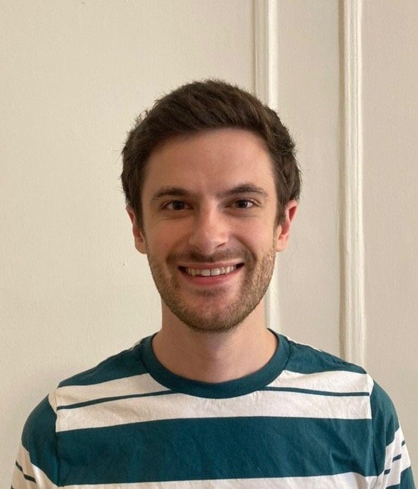

\

<h3 class="subtitle"> Cameron Chesbrough </h3>
  
   
 Cameron is a first year MS student in Biostatistics on the Public Health Data Science track. He currently interns with the Data and Systems Group at CMCS.

\

<h3 class="subtitle"> Ravi Brenner </h3>
  
   
 Ravi is a first-year MS biostatistics student in the public health data science track. 

\

<h3 class="subtitle"> Joseph LaRocca </h3>
  
   
 Joe is a first-year MS Biostatistics student on the Statistical Genetics track. He enjoys watching and talking baseball in his free time! 

\

<h3 class="subtitle"> Mengyao Tang </h3>
  
   
 Mengyao is a first year student pursuing her master in the epidemiology department. She aims to contribute to innovative research and meaningful solutions in the field of epidemiology.

\

<h3 class="subtitle"> Cheng Rao </h3>
  
   
 Cheng Rao is a first year student pursuing his master in the biostatistic department. He would like to engage in research related to pharmaceutical clinical statistics in the future as much as possible. 

