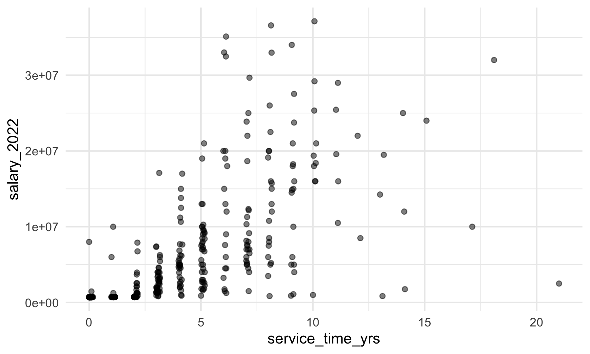
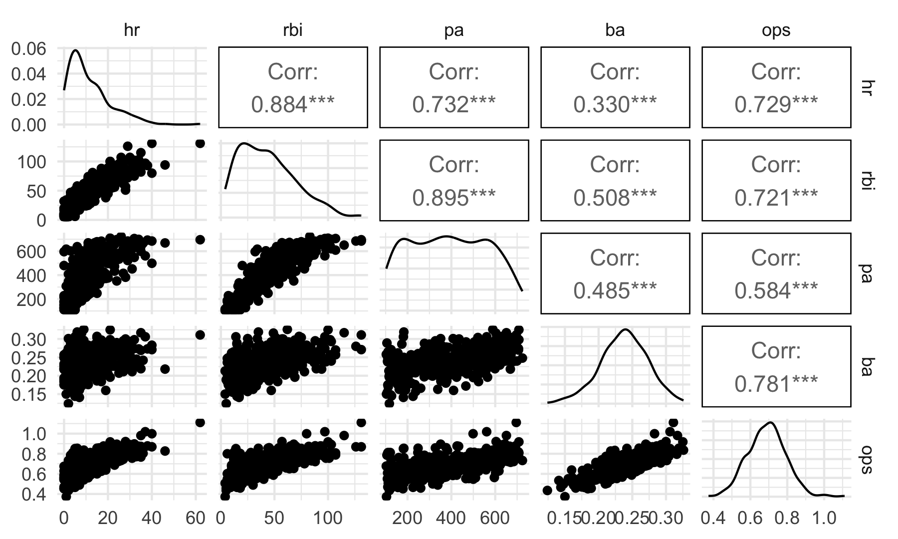
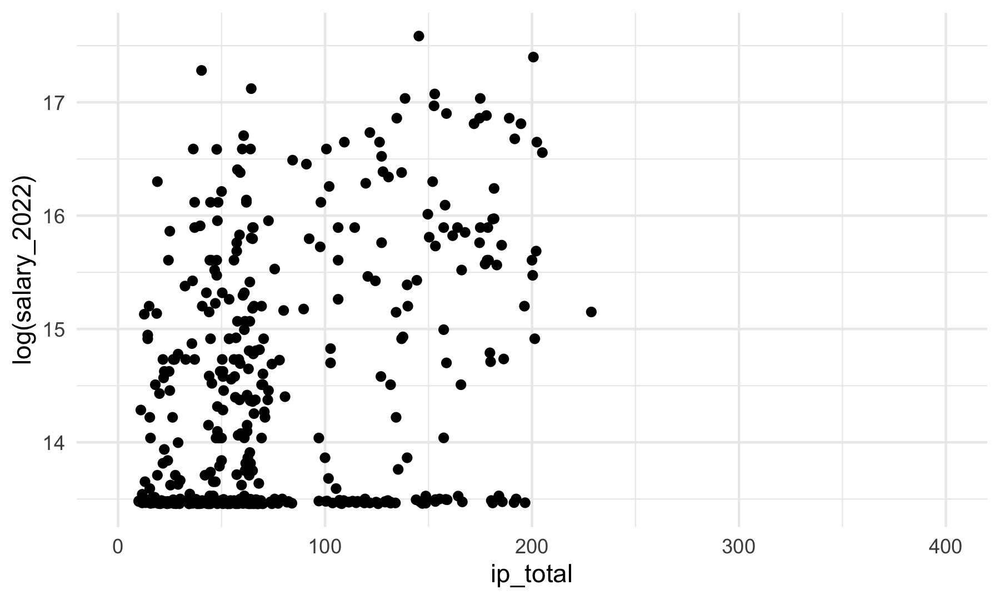

Preliminary analysis
================

#### Salaries Dataset

Descrition of data cleaning:

- reading in data

- selecting and renaming the columns

- since names are in last, first format, reorder them to be first last

- make sure all “Jr”s go at the end

- remove accents using stringi::stri_trans_general

``` r
salaries = read_excel(
  "data/MLB-Salaries 2000-24.xlsx", 
  sheet = "2022.xls",
  skip = 1) |>
  select(1:4) |>
  rename(position = "Pos'n",
         salary_2022 = "2022.0",
         service_time_yrs = "MLS",
         name = "Player") %>%
  mutate(name = str_split(name, ","),
         name = map(name, rev),       
         name = map_chr(name, str_c, collapse = " "),
         name = str_trim(name),
         name = str_replace_all(name, "[*#\\.,]", ""),
         junior = str_detect(name, "Jr"),
         name = if_else(junior == TRUE, str_remove(name, " Jr"), name),
         name = if_else(junior == TRUE, str_c(name, " Jr"), name),
         name = stringi::stri_trans_general(name,id = "Latin-ASCII")) |>
  select(-junior)
```

    ## New names:
    ## • `` -> `...5`

#### Batting and Pitching Datasets

Descrition of data cleaning:

- reading in data and clean names

- grouping by name and using a count to ensure we only end up with one
  of each name (slightly complicated due to interleague trades and
  potential for players with the same name)

- remove whitespace, from names and use stringi again to remove accents
  so that the formatting exactly matches the salaries tibble

- Filter out those with fewer than 100 plate appearances

``` r
batting = read_delim("data/2022 MLB Player Stats - Batting.csv", delim = ";",
                     locale = locale(encoding = "latin1")) |>
  janitor::clean_names() %>%
  group_by(name) |>
  mutate(name_count = n(),
         keep_row = case_when(name_count == 1 ~ TRUE,
                              name_count > 1 & tm == "TOT" ~ TRUE,
                              .default = FALSE)) |>
  filter(keep_row == TRUE) %>%
  mutate(name_count = n(),
         keep_row = case_when(name_count == 1 ~ TRUE,
                              name_count > 1 & lg == "MLB" ~ TRUE,
                              .default = FALSE)) |>
  ungroup() |>
  filter(keep_row == TRUE) %>%
  mutate(name = str_split(name, "\\s+"),
         name = map_chr(name, str_c, collapse = " "),
         name = str_trim(name),
         name = str_replace_all(name, "[*#\\.]", ""),
         name = stringi::stri_trans_general(name,id = "Latin-ASCII"))
```

    ## Rows: 992 Columns: 29
    ## ── Column specification ────────────────────────────────────────────────────────
    ## Delimiter: ";"
    ## chr  (3): Name, Tm, Lg
    ## dbl (26): Rk, Age, G, PA, AB, R, H, 2B, 3B, HR, RBI, SB, CS, BB, SO, BA, OBP...
    ## 
    ## ℹ Use `spec()` to retrieve the full column specification for this data.
    ## ℹ Specify the column types or set `show_col_types = FALSE` to quiet this message.

``` r
merged_batting <- inner_join(salaries, batting, by = "name") |>
  filter(pa >= 100)

salary_not_in_batting <- anti_join(salaries, batting, by = "name")
batting_not_in_salary <- anti_join(batting, salaries, by = "name")
```

(same data cleaning process as above)

``` r
pitching = read_delim("data/2022 MLB Player Stats - Pitching.csv", delim = ";",
                     locale = locale(encoding = "latin1")) |>
  janitor::clean_names() %>%
  group_by(name) |>
  mutate(name_count = n(),
         keep_row = case_when(name_count == 1 ~ TRUE,
                              name_count > 1 & tm == "TOT" ~ TRUE,
                              .default = FALSE)) |>
  filter(keep_row == TRUE) %>%
  mutate(name_count = n(),
         keep_row = case_when(name_count == 1 ~ TRUE,
                              name_count > 1 & lg == "MLB" ~ TRUE,
                              .default = FALSE)) |>
  ungroup() |>
  filter(keep_row == TRUE) %>%
  mutate(name = str_split(name, "\\s+"),
         name = map_chr(name, str_c, collapse = " "),
         name = str_trim(name),
         name = str_replace_all(name, "[*#\\.]", ""),
         name = stringi::stri_trans_general(name,id = "Latin-ASCII"))
```

    ## Rows: 1081 Columns: 35
    ## ── Column specification ────────────────────────────────────────────────────────
    ## Delimiter: ";"
    ## chr  (3): Name, Tm, Lg
    ## dbl (32): Rk, Age, W, L, W-L%, ERA, G, GS, GF, CG, SHO, SV, IP, H, R, ER, HR...
    ## 
    ## ℹ Use `spec()` to retrieve the full column specification for this data.
    ## ℹ Specify the column types or set `show_col_types = FALSE` to quiet this message.

``` r
merged_pitching <- inner_join(salaries, pitching, by = "name") |>
  filter(ip >= 10) |>
  separate(ip, into = c("ip", "ip_dec"), remove = FALSE, convert = TRUE) |>
  mutate(ip_dec_333 = ifelse(is.na(ip_dec), 0, ip_dec * 333)  ,
         ip_total = paste(ip, ip_dec_333, sep = "."),
         ip_total = as.numeric(ip_total)) |>
  select(-ip, -ip_dec, -ip_dec_333)
```

    ## Warning in inner_join(salaries, pitching, by = "name"): Detected an unexpected many-to-many relationship between `x` and `y`.
    ## ℹ Row 325 of `x` matches multiple rows in `y`.
    ## ℹ Row 265 of `y` matches multiple rows in `x`.
    ## ℹ If a many-to-many relationship is expected, set `relationship =
    ##   "many-to-many"` to silence this warning.

    ## Warning: Expected 2 pieces. Missing pieces filled with `NA` in 190 rows [5, 6, 10, 12,
    ## 14, 22, 24, 27, 30, 32, 33, 34, 36, 37, 39, 41, 42, 43, 44, 46, ...].

``` r
salary_not_in_pitching <- anti_join(salaries, pitching, by = "name")
pitching_not_in_salary <- anti_join(pitching, salaries, by = "name")
```

Note that there are a number of names in `salaries` not found in
`batting` or `pitching`, and vice versa. Some of this may be genuine
missingness (e.g. salaries has fewer rows than pitching and batting
combined), but some is also due to alternative spellings of names in the
datasets. Possibly could be fixed using other matching methods, but the
analysis pipeline will still work from here.

## Batting EDA

### Distributions of variables

Start with some descriptive statistics/plots

Service time (i.e. number of years of experience)

``` r
merged_batting |>
  ggplot(aes(x = service_time_yrs)) + 
  geom_density() +
  labs(x = "Service time")
```


This is left skewed, so may need to transform it if used in regression

Salary

``` r
merged_batting |>
  ggplot(aes(x = salary_2022)) + 
  geom_density() + 
  labs(x = "Salary")
```

    ## Warning: Removed 45 rows containing non-finite outside the scale range
    ## (`stat_density()`).


This is also heavily left skewed, with many players having salary under
\$1,000,000

Salary and service time are likely related, since rookies have contract
minimums

``` r
merged_batting |>
  ggplot(aes(x = service_time_yrs, y = salary_2022)) + 
  geom_point(alpha = 0.5) 
```

    ## Warning: Removed 45 rows containing missing values or values outside the scale range
    ## (`geom_point()`).



Position type

``` r
merged_batting |>
  mutate(positions = str_split_i(position, "-",1))  |>
  count(positions) |> 
  arrange(-n) |>
  knitr::kable()
```

| positions |   n |
|:----------|----:|
| 2b        |  64 |
| c         |  59 |
| ss        |  54 |
| 3b        |  46 |
| 1b        |  40 |
| of        |  38 |
| cf        |  33 |
| rf        |  30 |
| lf        |  25 |
| dh        |   7 |
| rhp       |   4 |
| inf       |   2 |
| lhp       |   2 |

Since we filtered on plate appearances, most players in the batting
dataset are position players (i.e., not pitchers). If we use this in
regression analysis, we may want to filter out pitchers entirely.

Looking at some hitting statistics

``` r
merged_batting |> 
  ggplot(aes(x = hr)) + 
  geom_histogram() +
  labs(x = "Number of home runs (HRs)")
```

    ## `stat_bin()` using `bins = 30`. Pick better value with `binwidth`.


``` r
merged_batting |> 
  ggplot(aes(x = rbi)) + 
  geom_histogram() +
  labs(x = "Runs batted in (RBI)")
```

    ## `stat_bin()` using `bins = 30`. Pick better value with `binwidth`.


These are also left skewed so will need to normalize for any linear
model.

OPS is an “all in one” statistic combining on-base percentage (OBP) and
slugging (SLG).

OBP is calculated as
$\frac{Hits (H) + Walks (BB) + Hit by pitch (HBP)}{At \ bats (AB) + Walks (BB) + sacrifice \ flies (SF) + Hit by pitch (HBP)}$

Slugging is calculated as $\frac{total \ bases (TB)}{At \ bats (AB)}$

OPS is the sum of these two statistics.

OPS+ (or adjusted OPS) is adjusted for the park and league averages.

``` r
merged_batting |> 
  ggplot(aes(x = ops)) + 
  geom_histogram() +
  labs(x = "OPS")
```

    ## `stat_bin()` using `bins = 30`. Pick better value with `binwidth`.


``` r
merged_batting |> 
  ggplot(aes(x = ops_2)) + 
  geom_histogram() +
  labs(x = "OPS+")
```

    ## `stat_bin()` using `bins = 30`. Pick better value with `binwidth`.


One idea might be to compare OPS or OPS+ to more traditional statistics,
like RBIs, HRs, or batting averages to OPS or OPS+ as single predictors
of salary.

One other factor to consider is the correlation between some of these
variables

``` r
merged_batting |>
  select(hr, rbi, pa, ba, ops) |>
  GGally::ggpairs()
```

    ## Registered S3 method overwritten by 'GGally':
    ##   method from   
    ##   +.gg   ggplot2



Some of these potential predictors are fairly strongly correlated (like
RBI and HR, or BA and OPS), so it’s important not to include to many
collinear variables in a potential linear model.

### Relationship to salary

Looking at some relationships to salary

Position vs. salary

``` r
merged_batting |>
  mutate(positions = str_split_i(position, "-",1))  |>
  ggplot(aes(x = positions,y= salary_2022)) +
  geom_boxplot()
```

    ## Warning: Removed 45 rows containing non-finite outside the scale range
    ## (`stat_boxplot()`).


``` r
merged_batting |>
  mutate(positions = str_split_i(position, "-",1))  |>
  group_by(positions) |>
  summarize(avg_salary = mean(salary_2022, na.rm = TRUE),
            median_salary = median(salary_2022, na.rm = TRUE))
```

    ## # A tibble: 13 × 3
    ##    positions avg_salary median_salary
    ##    <chr>          <dbl>         <dbl>
    ##  1 1b          8845755.       6225000
    ##  2 2b          5010094.       2550000
    ##  3 3b          8302384.       3375000
    ##  4 c           3669983.       1750000
    ##  5 cf          8145270.       5500000
    ##  6 dh         11857143.      12000000
    ##  7 inf         1312500        1312500
    ##  8 lf          6971404.       6125000
    ##  9 lhp        13000000       13000000
    ## 10 of          2211196.        746100
    ## 11 rf          7833411.       4875000
    ## 12 rhp         2679125        2250750
    ## 13 ss          7266837        4000000

HR vs. salary

``` r
merged_batting |>
  ggplot(aes(x = hr, y = salary_2022)) + 
  geom_point()
```

    ## Warning: Removed 45 rows containing missing values or values outside the scale range
    ## (`geom_point()`).


RBI vs. salary

``` r
merged_batting |>
  ggplot(aes(x = rbi, y = salary_2022)) + 
  geom_point()
```

    ## Warning: Removed 45 rows containing missing values or values outside the scale range
    ## (`geom_point()`).


BA vs. salary

``` r
merged_batting |>
  ggplot(aes(x = ba, y = salary_2022)) + 
  geom_point()
```

    ## Warning: Removed 45 rows containing missing values or values outside the scale range
    ## (`geom_point()`).


Plate appearances vs. salary

``` r
merged_batting |>
  ggplot(aes(x = pa, y = salary_2022)) + 
  geom_point()
```

    ## Warning: Removed 45 rows containing missing values or values outside the scale range
    ## (`geom_point()`).


OPS+ vs salary

``` r
merged_batting |>
  ggplot(aes(x = ops_2, y = salary_2022)) + 
  geom_point()
```

    ## Warning: Removed 45 rows containing missing values or values outside the scale range
    ## (`geom_point()`).


### Regression models

## Pitching EDA

In order to eliminate pitchers with very few appearances or position
players (catchers, first basemen, etc.) who came in to pitch in
blowouts, I filtered only for pitchers with at least 10 innings pitches.

### Distribution of Innings Pitched

``` r
merged_pitching |> 
  ggplot(aes(x = ip_total)) + 
  geom_histogram(binwidth = 2, fill = "lightblue", col = "black")
```


### Distribution of ERA+

``` r
merged_pitching |>
  ggplot(aes(x = era_2)) + 
  geom_histogram(fill = "lightblue", col = "black")
```

    ## `stat_bin()` using `bins = 30`. Pick better value with `binwidth`.


### IP vs. Salary Plot

``` r
merged_pitching |> 
  ggplot(aes(x = ip_total, y = salary_2022)) + 
  geom_point() + 
  scale_x_continuous(lim = c(0, 400))
```

    ## Warning: Removed 82 rows containing missing values or values outside the scale range
    ## (`geom_point()`).


### ERA+ vs. Salary Plot

``` r
merged_pitching |> 
  ggplot(aes(x = era_2, y = salary_2022)) + 
  geom_point() +
  scale_x_continuous(lim = c(0, 400))
```

    ## Warning: Removed 83 rows containing missing values or values outside the scale range
    ## (`geom_point()`).


### IP vs. Log Salary Plot

``` r
merged_pitching |> 
  ggplot(aes(x = ip_total, y = log(salary_2022))) + 
  geom_point() + 
  scale_x_continuous(lim = c(0, 400))
```

    ## Warning: Removed 82 rows containing missing values or values outside the scale range
    ## (`geom_point()`).



### ERA+ vs. Log Salary Plot

``` r
merged_pitching |> 
  ggplot(aes(x = era_2, y = log(salary_2022))) + 
  geom_point() + 
  scale_x_continuous(lim = c(0, 400))
```

    ## Warning: Removed 83 rows containing missing values or values outside the scale range
    ## (`geom_point()`).


### LMs

``` r
lm_ip = lm(salary_2022 ~ ip_total, data = merged_pitching)
summary(lm_ip)
```

    ## 
    ## Call:
    ## lm(formula = salary_2022 ~ ip_total, data = merged_pitching)
    ## 
    ## Residuals:
    ##      Min       1Q   Median       3Q      Max 
    ## -7812921 -2275356 -1243946   468480 36893416 
    ## 
    ## Coefficients:
    ##             Estimate Std. Error t value Pr(>|t|)    
    ## (Intercept)   553313     445037   1.243    0.214    
    ## ip_total       40504       4819   8.405 5.69e-16 ***
    ## ---
    ## Signif. codes:  0 '***' 0.001 '**' 0.01 '*' 0.05 '.' 0.1 ' ' 1
    ## 
    ## Residual standard error: 5226000 on 450 degrees of freedom
    ##   (82 observations deleted due to missingness)
    ## Multiple R-squared:  0.1357, Adjusted R-squared:  0.1338 
    ## F-statistic: 70.64 on 1 and 450 DF,  p-value: 5.692e-16

``` r
lm_ip_data = tibble(fitted.values(lm_ip), residuals(lm_ip))

names(lm_ip_data) = c("fitted", "resid")

lm_ip_data |>
  ggplot(aes(x = fitted, y = resid)) +
  geom_point()
```


``` r
view(lm_ip_data)
```

``` r
lm_era_2 = lm(salary_2022 ~ era_2, data = merged_pitching)
summary(lm_era_2)
```

    ## 
    ## Call:
    ## lm(formula = salary_2022 ~ era_2, data = merged_pitching)
    ## 
    ## Residuals:
    ##      Min       1Q   Median       3Q      Max 
    ## -4479909 -2909137 -2622729   250452 39463896 
    ## 
    ## Coefficients:
    ##             Estimate Std. Error t value Pr(>|t|)    
    ## (Intercept)  3263308     630867   5.173 3.48e-07 ***
    ## era_2           3587       5034   0.712    0.477    
    ## ---
    ## Signif. codes:  0 '***' 0.001 '**' 0.01 '*' 0.05 '.' 0.1 ' ' 1
    ## 
    ## Residual standard error: 5618000 on 450 degrees of freedom
    ##   (82 observations deleted due to missingness)
    ## Multiple R-squared:  0.001127,   Adjusted R-squared:  -0.001093 
    ## F-statistic: 0.5076 on 1 and 450 DF,  p-value: 0.4765

``` r
lm_era_2_data = tibble(fitted.values(lm_era_2), residuals(lm_era_2))

names(lm_era_2_data) = c("fitted", "resid")

lm_era_2_data |>
  ggplot(aes(x = fitted, y = resid)) +
  geom_point()
```


``` r
view(lm_era_2_data)
```

### Log-Transformed LMs

``` r
lm_ip_log = lm(log(salary_2022) ~ ip_total, data = merged_pitching)
```

## Salaries EDA

Some Basic EDA for salaries on their own

``` r
salaries_position_split = salaries %>%
  mutate(simple_position = str_split_i(position, "-", 1))

# Salaries by Position Boxplots

salaries_position_split %>% 
  ggplot(aes(x=simple_position,y=salary_2022)) +
  geom_boxplot()
```

    ## Warning: Removed 295 rows containing non-finite outside the scale range
    ## (`stat_boxplot()`).


``` r
# Salaries by Experience 

salaries_position_split %>%
  ggplot(aes(x=floor(service_time_yrs),y=salary_2022)) +
  geom_col() 
```

    ## Warning: Removed 295 rows containing missing values or values outside the scale range
    ## (`geom_col()`).


``` r
# Positions by Experience

salaries_position_split %>%
  ggplot(aes(x=floor(service_time_yrs),fill = simple_position)) +
  geom_bar(position = "fill") 
```


``` r
# Salary Distribution by Experience

salaries_position_split %>%
  ggplot(aes(x=factor(floor(service_time_yrs)), y=salary_2022)) +
  geom_boxplot()
```

    ## Warning: Removed 295 rows containing non-finite outside the scale range
    ## (`stat_boxplot()`).


