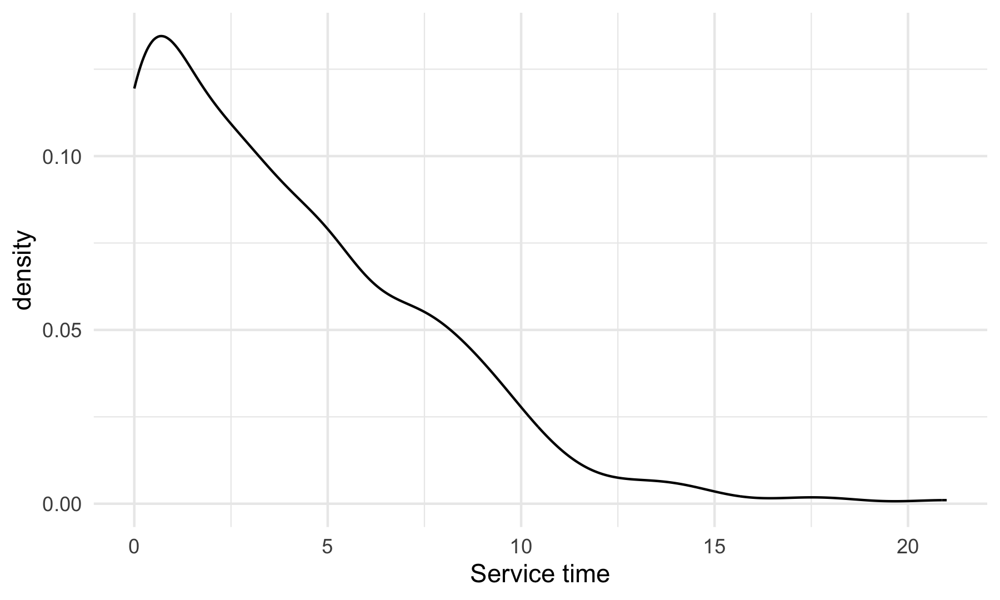
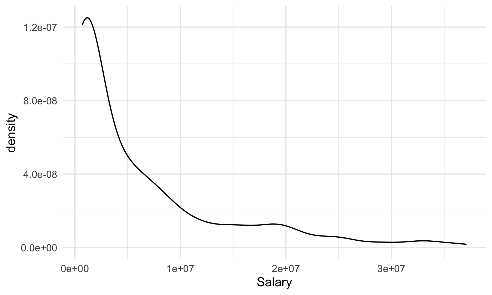
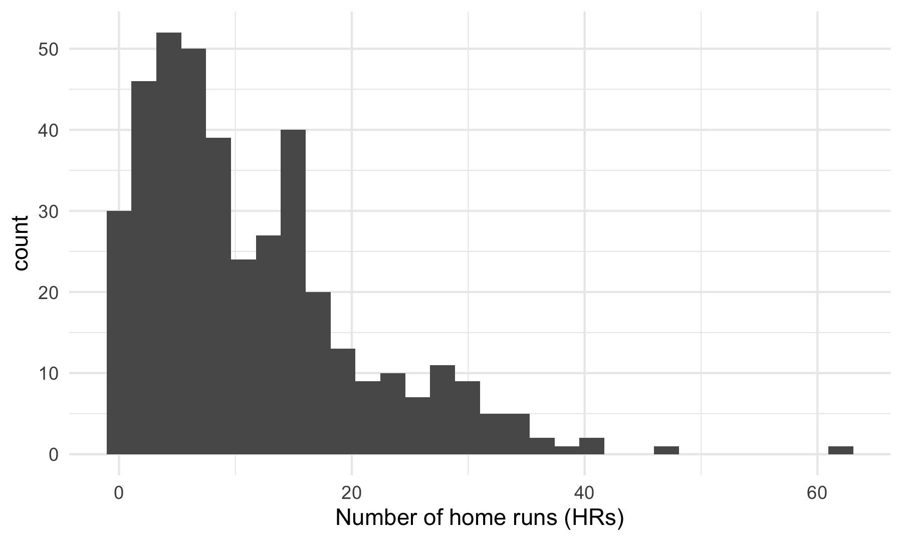
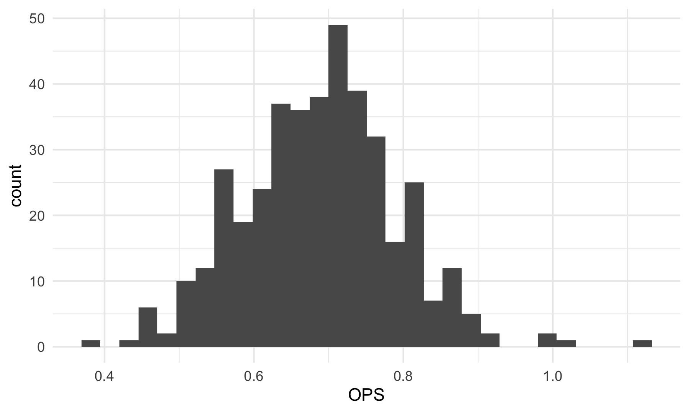

Preliminary analysis
================

#### Salaries Dataset

Descrition of data cleaning:

- reading in data

- selecting and renaming the columns

- since names are in last, first format, reorder them to be first last

- make sure all “Jr”s go at the end

- remove accents using stringi::stri_trans_general

``` r
salaries = read_excel(
  "data/MLB-Salaries 2000-24.xlsx", 
  sheet = "2022.xls",
  skip = 1) |>
  select(1:4) |>
  rename(position = "Pos'n",
         salary_2022 = "2022.0",
         service_time_yrs = "MLS",
         name = "Player") %>%
  mutate(name = str_split(name, ","),
         name = map(name, rev),       
         name = map_chr(name, str_c, collapse = " "),
         name = str_trim(name),
         name = str_replace_all(name, "[*#\\.,]", ""),
         junior = str_detect(name, "Jr"),
         name = if_else(junior == TRUE, str_remove(name, " Jr"), name),
         name = if_else(junior == TRUE, str_c(name, " Jr"), name),
         name = stringi::stri_trans_general(name,id = "Latin-ASCII")) |>
  select(-junior)
```

    ## New names:
    ## • `` -> `...5`

#### Batting and Pitching Datasets

Descrition of data cleaning:

- reading in data and clean names

- grouping by name and using a count to ensure we only end up with one
  of each name (slightly complicated due to interleague trades and
  potential for players with the same name)

- remove whitespace, from names and use stringi again to remove accents
  so that the formatting exactly matches the salaries tibble

``` r
batting = read_delim("data/2022 MLB Player Stats - Batting.csv", delim = ";",
                     locale = locale(encoding = "latin1")) |>
  janitor::clean_names() %>%
  group_by(name) |>
  mutate(name_count = n(),
         keep_row = case_when(name_count == 1 ~ TRUE,
                              name_count > 1 & tm == "TOT" ~ TRUE,
                              .default = FALSE)) |>
  filter(keep_row == TRUE) %>%
  mutate(name_count = n(),
         keep_row = case_when(name_count == 1 ~ TRUE,
                              name_count > 1 & lg == "MLB" ~ TRUE,
                              .default = FALSE)) |>
  ungroup() |>
  filter(keep_row == TRUE) %>%
  mutate(name = str_split(name, "\\s+"),
         name = map_chr(name, str_c, collapse = " "),
         name = str_trim(name),
         name = str_replace_all(name, "[*#\\.]", ""),
         name = stringi::stri_trans_general(name,id = "Latin-ASCII"))
```

    ## Rows: 992 Columns: 29
    ## ── Column specification ────────────────────────────────────────────────────────
    ## Delimiter: ";"
    ## chr  (3): Name, Tm, Lg
    ## dbl (26): Rk, Age, G, PA, AB, R, H, 2B, 3B, HR, RBI, SB, CS, BB, SO, BA, OBP...
    ## 
    ## ℹ Use `spec()` to retrieve the full column specification for this data.
    ## ℹ Specify the column types or set `show_col_types = FALSE` to quiet this message.

``` r
merged_batting <- inner_join(salaries, batting, by = "name")

salary_not_in_batting <- anti_join(salaries, batting, by = "name")
batting_not_in_salary <- anti_join(batting, salaries, by = "name")
```

(same data cleaning process as above)

``` r
pitching = read_delim("data/2022 MLB Player Stats - Pitching.csv", delim = ";",
                     locale = locale(encoding = "latin1")) |>
  janitor::clean_names() %>%
  group_by(name) |>
  mutate(name_count = n(),
         keep_row = case_when(name_count == 1 ~ TRUE,
                              name_count > 1 & tm == "TOT" ~ TRUE,
                              .default = FALSE)) |>
  filter(keep_row == TRUE) %>%
  mutate(name_count = n(),
         keep_row = case_when(name_count == 1 ~ TRUE,
                              name_count > 1 & lg == "MLB" ~ TRUE,
                              .default = FALSE)) |>
  ungroup() |>
  filter(keep_row == TRUE) %>%
  mutate(name = str_split(name, "\\s+"),
         name = map_chr(name, str_c, collapse = " "),
         name = str_trim(name),
         name = str_replace_all(name, "[*#\\.]", ""),
         name = stringi::stri_trans_general(name,id = "Latin-ASCII"))
```

    ## Rows: 1081 Columns: 35
    ## ── Column specification ────────────────────────────────────────────────────────
    ## Delimiter: ";"
    ## chr  (3): Name, Tm, Lg
    ## dbl (32): Rk, Age, W, L, W-L%, ERA, G, GS, GF, CG, SHO, SV, IP, H, R, ER, HR...
    ## 
    ## ℹ Use `spec()` to retrieve the full column specification for this data.
    ## ℹ Specify the column types or set `show_col_types = FALSE` to quiet this message.

``` r
merged_pitching <- inner_join(salaries, pitching, by = "name")
```

    ## Warning in inner_join(salaries, pitching, by = "name"): Detected an unexpected many-to-many relationship between `x` and `y`.
    ## ℹ Row 325 of `x` matches multiple rows in `y`.
    ## ℹ Row 265 of `y` matches multiple rows in `x`.
    ## ℹ If a many-to-many relationship is expected, set `relationship =
    ##   "many-to-many"` to silence this warning.

``` r
salary_not_in_pitching <- anti_join(salaries, pitching, by = "name")
pitching_not_in_salary <- anti_join(pitching, salaries, by = "name")
```

Note that there are a number of names in `salaries` not found in
`batting` or `pitching`, and vice versa. Some of this may be genuine
missingness (e.g. salaries has fewer rows than pitching and batting
combined), but some is also due to alternative spellings of names in the
datasets. Possibly could be fixed using other matching methods, but the
analysis pipeline will still work from here.

## Batting EDA

Start with some descriptive statistics/plots

``` r
merged_batting |>
  ggplot(aes(x = service_time_yrs)) + 
  geom_density()
```



``` r
merged_batting |>
  ggplot(aes(x = salary_2022)) + 
  geom_density()
```

    ## Warning: Removed 109 rows containing non-finite outside the scale range
    ## (`stat_density()`).



Position type (note that some players are categorized at multiple
positions)

``` r
merged_batting |>
  mutate(positions = case_when(str_detect(position, "rhp") ~ list("rhp"),
                               str_detect(position, "lhp") ~ list("lhp"),
                               .default = str_split(position, "-")))  |>
  unnest(positions) |>
  count(positions) |> 
  arrange(-n)
```

    ## # A tibble: 13 × 2
    ##    positions     n
    ##    <chr>     <int>
    ##  1 c            87
    ##  2 2b           80
    ##  3 ss           78
    ##  4 rhp          69
    ##  5 3b           68
    ##  6 of           67
    ##  7 1b           51
    ##  8 cf           43
    ##  9 rf           40
    ## 10 lf           29
    ## 11 lhp          23
    ## 12 dh           13
    ## 13 inf           3

Looking at some hitting statistics

``` r
merged_batting |> 
  ggplot(aes(x = hr)) + 
  geom_histogram()
```

    ## `stat_bin()` using `bins = 30`. Pick better value with `binwidth`.


``` r
merged_batting |> 
  ggplot(aes(x = rbi)) + 
  geom_histogram()
```

    ## `stat_bin()` using `bins = 30`. Pick better value with `binwidth`.


``` r
merged_batting |> 
  ggplot(aes(x = ops)) + 
  geom_histogram()
```

    ## `stat_bin()` using `bins = 30`. Pick better value with `binwidth`.


``` r
merged_batting |> 
  ggplot(aes(x = ops_2)) + 
  geom_histogram()
```

    ## `stat_bin()` using `bins = 30`. Pick better value with `binwidth`.


Looking at some relationships to salary

Position vs. salary

``` r
merged_batting |>
  mutate(positions = case_when(str_detect(position, "rhp") ~ list("rhp"),
                               str_detect(position, "lhp") ~ list("lhp"),
                               .default = str_split(position, "-")))  |>
  unnest(positions) |>
  ggplot(aes(x = positions,y= salary_2022)) +
  geom_boxplot()
```

    ## Warning: Removed 115 rows containing non-finite outside the scale range
    ## (`stat_boxplot()`).



``` r
merged_batting |>
  mutate(positions = case_when(str_detect(position, "rhp") ~ list("rhp"),
                               str_detect(position, "lhp") ~ list("lhp"),
                               .default = str_split(position, "-")))  |>
  unnest(positions) |>
  group_by(positions) |>
  summarize(avg_salary = mean(salary_2022, na.rm = TRUE),
            median_salary = median(salary_2022, na.rm = TRUE))
```

    ## # A tibble: 13 × 3
    ##    positions avg_salary median_salary
    ##    <chr>          <dbl>         <dbl>
    ##  1 1b          7602152.       3475000
    ##  2 2b          4682245.       2530000
    ##  3 3b          7091750.       2800000
    ##  4 c           3223272.       1062500
    ##  5 cf          7341665.       3273077
    ##  6 dh         12252795.      12000000
    ##  7 inf         1312500        1312500
    ##  8 lf          7136788.       6125000
    ##  9 lhp         4051080        1400000
    ## 10 of          2545303.        800000
    ## 11 rf          8815324.       6875000
    ## 12 rhp         2629638.       1251500
    ## 13 ss          6339882.       2325000

HR vs. salary

``` r
merged_batting |>
  ggplot(aes(x = hr, y = salary_2022)) + 
  geom_point()
```

    ## Warning: Removed 109 rows containing missing values or values outside the scale range
    ## (`geom_point()`).



OPS+ vs salary

``` r
merged_batting |>
  ggplot(aes(x = ops_2, y = salary_2022)) + 
  geom_point()
```

    ## Warning: Removed 109 rows containing missing values or values outside the scale range
    ## (`geom_point()`).


## Pitching EDA
